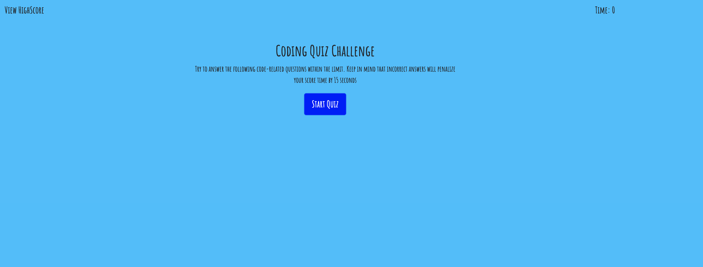
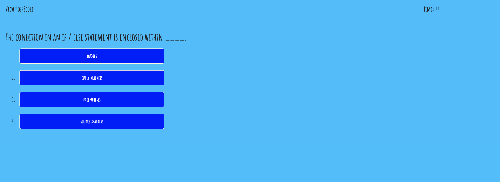
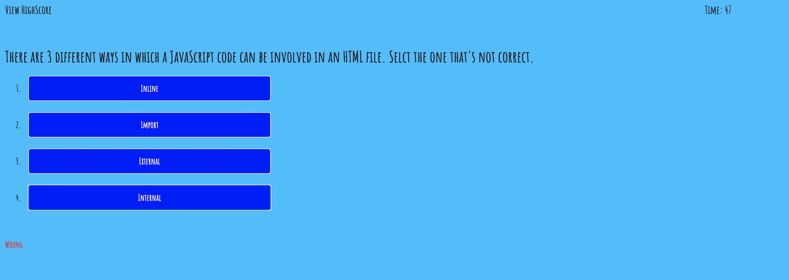
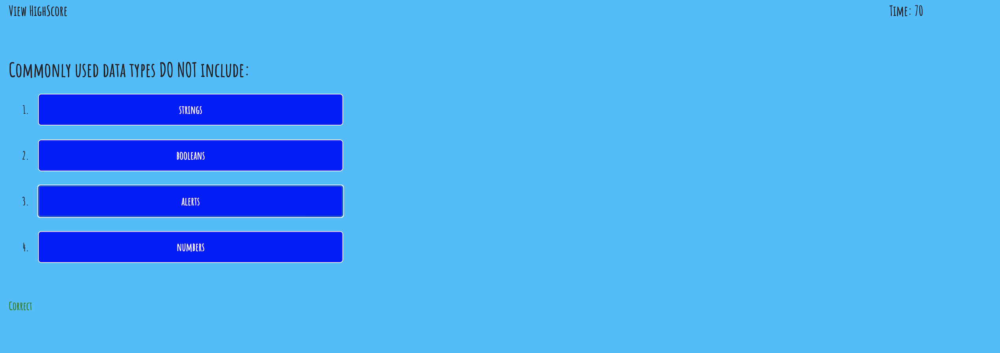
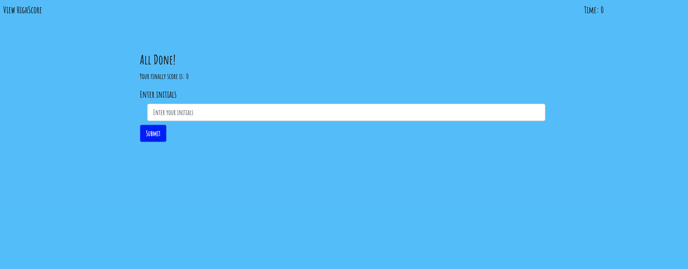
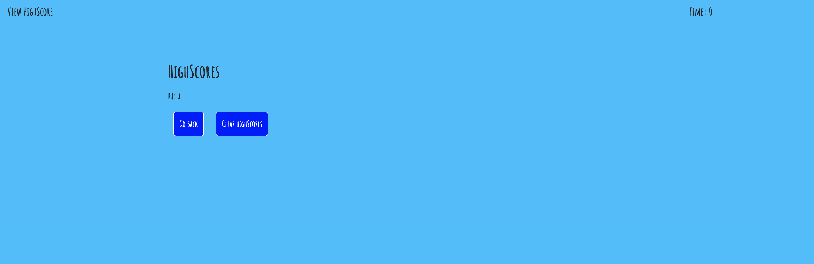

# Code Quiz

### Description:

Code quiz allows users to a take a code quiz after the click on the Code Quiz button.
* Loops through a number of questions and answers
* Displays to the user if the answer was incorrect or correct
* Displays the countdown for the alloted time to answer the question
* Displays the user score 

It was created using **HTML**, **CSS**, **Javascript**.

### Screenshots:

Begin

Answer the question

Wrong answer

Correct answer

All done

High score

## View my project: [https://lpnrhowell.github.io/Code-Quiz/](https://lpnrhowell.github.io/Code-Quiz/ "Optional link title")